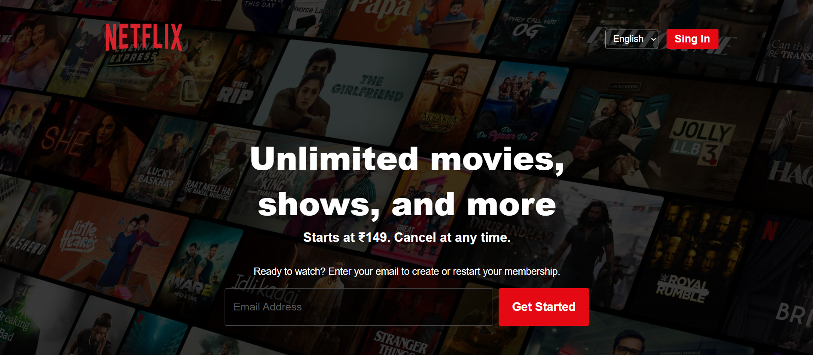
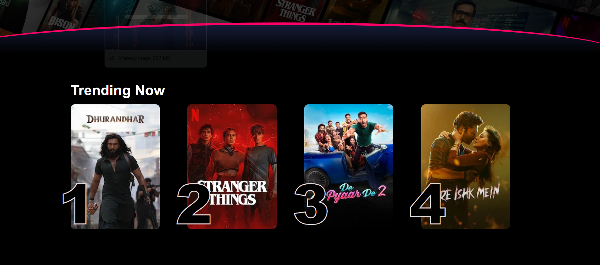
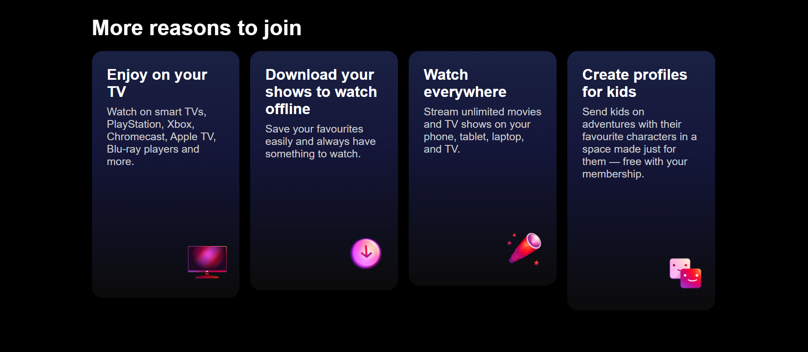
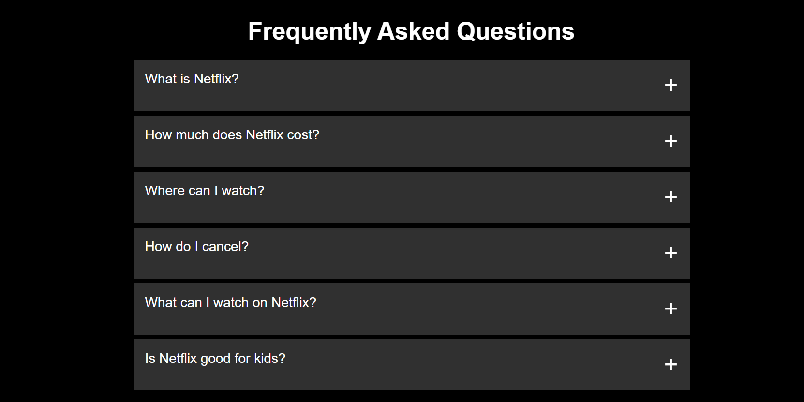
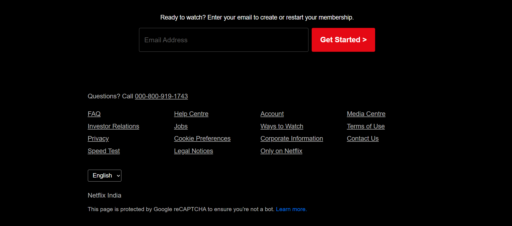

# 📌 Netflix Landing Page Clone

A static clone of the Netflix landing page created using pure **HTML** and **CSS**.  
This project focuses on UI layout, responsiveness, and visual accuracy inspired by the original Netflix homepage.

---

## 📸 Project Preview

> Add screenshots of your project here

Example:
```md






## 🚀 Features
•	Header packed with a logo, a language picker and a sign in button
•	Hero section with a cool background image and curved divider
•	Trending movies row with smooth hover effects
•	"More reasons to join" cards using gradient overlays
•	FAQ accordion (using native <details> and <summary> – no JS!)
•	Email signup for subscriptions
•	Footer packed with links and a language picker


## 🛠️ Technologies Used
•	HTML5
•	CSS3 (Flexbox, Grid, Gradients, Transitions)

##📁 Project Structure
📦 assignment2-06-02-2026
- ┣ 📂 assets
 -┃ ┗ 📸 images & icons
 ┣ 📜 index.html
 ┣ 📜 style.css
 ┗ 📜 README.md

##🎯 Purpose of This Project
•	Practice HTML semantic structure
•	Improve CSS layout skills (Flexbox & Grid)
•	Learn real-world UI cloning
•	Build a strong frontend portfolio project

##⚠️ Disclaimer
This project is created only for educational and practice purposes.
Netflix is a registered trademark, and this clone is not intended for commercial use.

##👩‍💻 Author
Bhagyalaxmi Behera
Frontend / Web Developer

